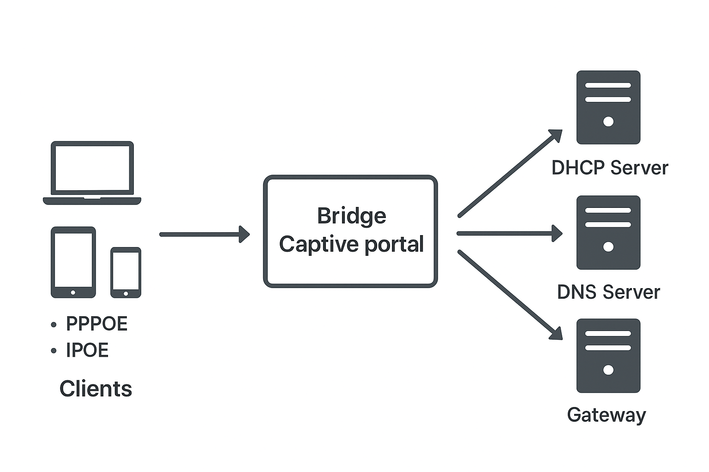

# 🧩 Captive Portal Project (NDIS Filter + Internal DHCP/DNS + GUI + Local Database)

## 📖 Overview
This project is a **custom captive portal system** for Windows, implementing a **network-level access control system** using a **kernel-mode NDIS filter driver**.  

It manages user authentication, session tracking, traffic control, and user management via a **desktop GUI** while maintaining a **high-performance local database** built with **pure C structures**.  

The system emphasizes **security, performance, and full control over network traffic**, protecting against unauthorized devices or servers.

---

## ⚙️ Key Features
- 🔒 **NDIS Filter Driver:** Intercepts and manages packets at OSI Layer 2.
- 🌐 **Built-in DHCP & DNS Servers**
  - Assigns IPs to clients
  - Redirects traffic to the captive portal
  - Protects by enforcing **gateway, DHCP, and DNS MAC/IP checks**
- 🌐 **Local DNS Parser**
  - Resolves captive portal hostname internally
  - Eliminates dependency on external DNS for initial redirection
- 🐍 **Python Web Server**
  - Serves login pages and session info
  - Communicates with the driver via **TCP sockets**
- 🖥️ **GUI**
  - User and session management
  - Network adapter configuration
- 🧮 **Local Database**
  - Stores user accounts, session states, and configuration using **pure C structures**
  - Efficient lookups with a **Radix Tree** for active sessions
- 🧾 **Encrypted Storage**
  - XOR-based encryption for sensitive data
- ⚡ **Cross-Platform Web Interface**
  - Frontend communicates with the driver via a DLL
- 🧾 **Billing System**
  - Tracks data usage per client

---

## 🏗️ System Architecture

1. **Client Devices:** Laptops, phones, or other networked devices (PPPoE/IPoE).  
2. **Bridge Captive Portal System:** NDIS filter, Python web server, internal DHCP/DNS, local database.  
3. **Backend Services:** Gateway, DHCP Server, DNS Server (with MAC/IP enforcement).  
4. **GUI & Administration:** Desktop interface communicates with backend and driver.

---

## 🌐 Built-in Local DNS Parser

The system includes a **lightweight internal DNS parser** that intercepts and processes DNS requests locally:

- Matches requests against the portal hostname
- Responds directly to clients without needing external DNS
- Provides fast redirection and offline operation

**Example Flow:**
1. Client sends DNS query for `bridge.local`.  
2. NDIS filter intercepts and parses the request.  
3. If domain matches the captive portal hostname:
   - Responds with internal IP
4. Otherwise, forwards to an external DNS server.

Implementation Highlights:
- Custom DNS header parsing
- Dynamic hostname recognition
- Packet crafting for DNS responses
- Fully implemented without external libraries

---

## 🐍 Python Web Server

The Python web server provides a bridge between the browser and the kernel-mode driver:

- Listens on TCP port 80/443
- Handles login and session requests
- Communicates with the driver using **local TCP sockets** for authentication, session updates, and quota tracking

> TCP sockets are used for driver communication; WebSockets are optional for live browser updates to the frontend.

---

## 🖥️ Graphical User Interface (GUI)

The desktop GUI allows administration of users, sessions, and network adapters:

**Key Features:**
- **User Management:** Add/edit/remove users, view sessions, set quotas
- **Network Adapter Configuration:** Detect adapters, assign IP ranges, configure modes (bridged/NAT)
- **Real-Time Status Monitoring:** Track connected clients, bandwidth, session duration
- **Logging & Notifications:** Activity logs, quota alerts, driver messages

**Implementation Notes:**
- Built using **C# Windows Forms** (or WPF)
- Communicates with the Python web server via TCP sockets
- Abstracts low-level kernel networking complexity for administrators

**Screenshot Example:**

---

## 🗄️ Local Database

The captive portal maintains a **high-performance local database**:

- Implemented using **pure C structures** (no external DB dependencies)
- Stores:
  - User accounts
  - Session states
  - Configuration parameters
- Efficient lookup with **Radix Tree**
- Data is encrypted (XOR-based) when stored on disk

---

## 📡 Traffic Flow

### Logged-in Devices
- Traffic is **forwarded normally** to the network
- Users can access the Internet according to assigned bandwidth/quotas

### Unlogged-in Devices
- **HTTP:** Clients are redirected with **HTTP 302** to the captive portal login page
- **Other traffic:** Packets are dropped
- Enforces MAC/IP checks for gateway, DHCP, and DNS to prevent unauthorized external servers

---

## 💻 Technologies & Tools Used
| Category | Technologies |
|----------|---------------|
| **Languages** | C, C++, C#, Python, Visual Basic |
| **Kernel Framework** | Windows Driver Kit (WDK) |
| **Networking** | NDIS, PPPoE, DHCP, DNS, TCP Sockets |
| **Data Handling** | Local database with C structures, Radix Tree, XOR Encryption |
| **Frontend** | ASP.NET / Bootstrap |

---

## 📬 Contact
**Author:** David Chirikutsi  
**LinkedIn:** [Your LinkedIn Profile]  
**Email:** [your.email@example.com]

---

## 🖼️ Screenshot Examples
| Admin Dashboard | Login Page | Architecture |
|-----------------|-----------|-------------|
|  |  |  |
